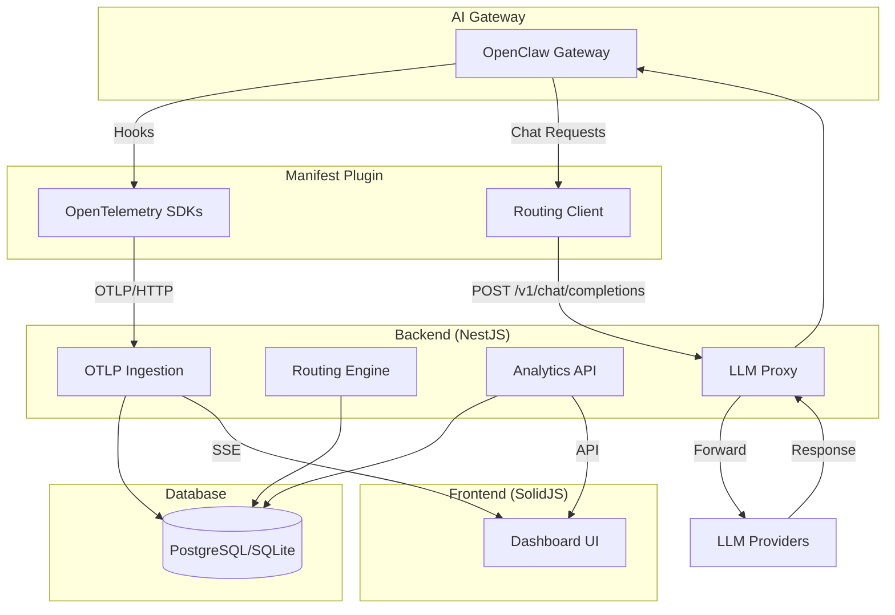
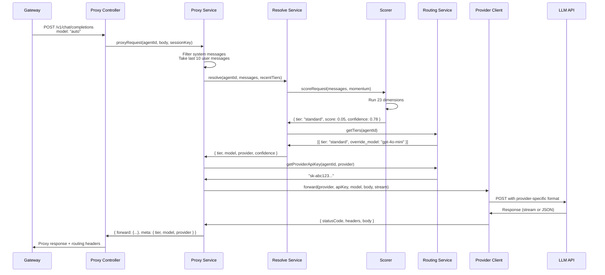

## High-Level Architecture

Manifest is a **single-service monorepo** that deploys as one unified application. The architecture consists of four main components:



## Plugin Layer

### Package: `manifest` (npm)

The OpenClaw plugin integrates with AI gateway platforms to capture telemetry and enable routing.

**Location**: `packages/openclaw-plugin/`

### Architecture

```typescript
// packages/openclaw-plugin/src/index.ts
export default async function manifestPlugin(
  api: PluginAPI,
  config: ManifestConfig,
  logger: PluginLogger,
) {
  // 1. Initialize OpenTelemetry exporters
  const { tracer, meter } = initTelemetry(config, logger);

  // 2. Register Manifest as OpenAI-compatible provider
  registerRouting(api, config, logger);

  // 3. Hook into gateway lifecycle
  api.on('agent_start', async (event) => {
    const span = tracer.startSpan('agent.request');
    event.context.span = span;
  });

  api.on('agent_end', async (event) => {
    const span = event.context.span;
    
    // Resolve routing metadata
    const routing = await resolveRouting(
      config,
      event.messages,
      event.sessionKey,
      logger,
    );
    
    // Set span attributes
    span.setAttributes({
      'gen_ai.system': routing.provider,
      'gen_ai.request.model': routing.model,
      'manifest.tier': routing.tier,
      'manifest.routing.confidence': routing.confidence,
    });
    
    span.end();
  });
}
```

### Telemetry Flow

<Steps>
  <Step title="Hook Registration">
    Plugin registers lifecycle hooks with the gateway (`agent_start`, `agent_end`, `agent_error`).
  </Step>
  <Step title="Span Creation">
    On `agent_start`, create OTLP span with `tracer.startSpan()`.
  </Step>
  <Step title="Attribute Collection">
    Gather attributes from gateway events (model, tokens, duration, error).
  </Step>
  <Step title="Routing Resolution">
    Call `/api/v1/routing/resolve` to get tier/model/provider.
  </Step>
  <Step title="Span Finalization">
    Set all attributes and call `span.end()` on `agent_end`.
  </Step>
  <Step title="Batch Export">
    OpenTelemetry SDK batches spans and sends via HTTP POST to `/otlp/v1/traces`.
  </Step>
</Steps>

### Session Tracking

The plugin maintains session momentum in-memory:

```typescript
// packages/openclaw-plugin/src/routing.ts:13-19
const momentum = new Map<string, MomentumEntry>();
const MOMENTUM_TTL_MS = 30 * 60 * 1000; // 30 minutes

interface MomentumEntry {
  tiers: string[];         // Last 5 tiers
  lastUpdated: number;     // Timestamp
}
```

Cleanup timer runs every 5 minutes to purge stale entries.

### Routing Integration

The plugin registers Manifest as a provider:

```typescript
// packages/openclaw-plugin/src/routing.ts:153-181
api.registerProvider({
  id: 'manifest',
  name: 'Manifest Router',
  api: 'openai-completions',
  baseUrl: config.endpoint.replace(/\/otlp.*/, ''),
  apiKey: config.apiKey,
  models: ['auto'], // Special model name for routing
});
```

When the gateway sends a request with `model: "auto"`, it routes to Manifest's proxy endpoint.

## Backend Layer

### Package: `manifest-backend` (private)

NestJS 11 API server handling ingestion, routing, and analytics.

**Location**: `packages/backend/`

### Module Structure

```
src/
├── main.ts                    # Bootstrap (Helmet, CORS, body parsing)
├── app.module.ts              # Root module (guards, static serving)
├── auth/                      # Better Auth integration
│   ├── auth.instance.ts       # betterAuth() config
│   ├── session.guard.ts       # Cookie session validation
│   └── local-auth.guard.ts    # Loopback-only auth (local mode)
├── database/                  # TypeORM setup
│   ├── database.module.ts     # PostgreSQL/SQLite config
│   ├── database-seeder.service.ts
│   └── migrations/            # Version-controlled migrations
├── entities/                  # 19 TypeORM entities
│   ├── tenant.entity.ts
│   ├── agent.entity.ts
│   ├── agent-message.entity.ts
│   ├── llm-call.entity.ts
│   └── ...
├── otlp/                      # OTLP ingestion
│   ├── otlp.controller.ts     # POST /otlp/v1/{traces,metrics,logs}
│   ├── guards/otlp-auth.guard.ts
│   └── services/
│       ├── otlp-decoder.service.ts
│       ├── trace-ingest.service.ts
│       ├── metric-ingest.service.ts
│       └── log-ingest.service.ts
├── routing/                   # LLM routing
│   ├── routing.controller.ts  # Tier config CRUD
│   ├── resolve.controller.ts  # POST /api/v1/routing/resolve
│   ├── resolve.service.ts     # Scoring + model selection
│   ├── proxy/                 # LLM proxy
│   │   ├── proxy.controller.ts   # POST /v1/chat/completions
│   │   ├── proxy.service.ts      # Routing logic
│   │   ├── provider-client.ts    # HTTP client for providers
│   │   ├── anthropic-adapter.ts  # Claude API format conversion
│   │   └── google-adapter.ts     # Gemini API format conversion
│   └── scorer/                # 23-dimension algorithm
│       ├── index.ts           # Main scoring logic
│       ├── config.ts          # Default weights & boundaries
│       ├── keyword-trie.ts    # O(n) keyword matching
│       └── dimensions/
│           ├── keyword-dimensions.ts
│           ├── structural-dimensions.ts
│           └── contextual-dimensions.ts
├── analytics/                 # Dashboard APIs
│   ├── controllers/           # 5 controllers (overview, tokens, costs, messages, agents)
│   └── services/              # Query builders + aggregation
├── model-prices/              # Model pricing management
│   ├── model-pricing-cache.service.ts
│   └── model-pricing-sync.service.ts
├── notifications/             # Alert rules + email
│   ├── services/notification-cron.service.ts
│   └── services/limit-check.service.ts
├── security/                  # Security event detection
├── sse/                       # Server-Sent Events
├── health/                    # Health check endpoint
└── common/                    # Shared utilities
    ├── guards/api-key.guard.ts
    ├── utils/hash.util.ts     # scrypt KDF for API keys
    ├── utils/crypto.util.ts   # AES-256-GCM encryption
    └── services/ingest-event-bus.service.ts
```

### Guard Chain

Three global guards run on every request:

1. **SessionGuard** / **LocalAuthGuard** (mode-dependent)
   - Cloud: Validates Better Auth cookie session
   - Local: Checks loopback IP (127.0.0.1/::1)
2. **ApiKeyGuard**
   - Falls through if session exists
   - Validates `X-API-Key` header (timing-safe compare)
3. **ThrottlerGuard**
   - Rate limiting (default: 100 req/min)

```typescript
// packages/backend/src/app.module.ts:64-68
providers: [
  { provide: APP_GUARD, useClass: sessionGuardClass },
  { provide: APP_GUARD, useClass: ApiKeyGuard },
  { provide: APP_GUARD, useClass: ThrottlerGuard },
]
```

### Authentication Architecture

#### Cloud Mode (Better Auth)

```typescript
// packages/backend/src/auth/auth.instance.ts
import { betterAuth } from 'better-auth';
import { Pool } from 'pg';

const pool = new Pool({
  connectionString: process.env.DATABASE_URL,
});

export const auth = betterAuth({
  database: pool,
  emailAndPassword: {
    enabled: true,
    requireEmailVerification: true,
  },
  socialProviders: {
    google: { 
      clientId: process.env.GOOGLE_CLIENT_ID!, 
      clientSecret: process.env.GOOGLE_CLIENT_SECRET! 
    },
    github: { /* ... */ },
    discord: { /* ... */ },
  },
});
```

Mounted in `main.ts` **before** `express.json()` (Better Auth needs raw body control):

```typescript
// packages/backend/src/main.ts:76-81
const { toNodeHandler } = require('better-auth/node');
expressApp.all('/api/auth/*splat', toNodeHandler(auth!));
```

#### Local Mode (Loopback Auth)

```typescript
// packages/backend/src/auth/local-auth.guard.ts
const LOOPBACK_IPS = new Set(['127.0.0.1', '::1', '::ffff:127.0.0.1']);

if (LOOPBACK_IPS.has(clientIp)) {
  request.user = { id: LOCAL_USER_ID, email: LOCAL_EMAIL };
  return true;
}
throw new UnauthorizedException();
```

Simple session endpoints:

```typescript
// packages/backend/src/main.ts:63-72
expressApp.get('/api/auth/get-session', (req, res) => {
  if (!LOOPBACK_IPS.has(req.ip)) {
    return res.status(403).json({ error: 'Forbidden' });
  }
  res.json({
    session: { id: 'local-session', userId: LOCAL_USER_ID },
    user: { id: LOCAL_USER_ID, name: 'Local User', email: LOCAL_EMAIL },
  });
});
```

### OTLP Ingestion Deep Dive

#### OtlpAuthGuard

Validates Bearer tokens against hashed API keys:

```typescript
// packages/backend/src/otlp/guards/otlp-auth.guard.ts
const apiKey = authHeader.replace(/^Bearer\s+/i, '');

// Check cache first (5-minute TTL)
let ctx = this.cache.get(apiKey);
if (ctx) {
  request.ingestionContext = ctx;
  return true;
}

// Query database
const agentKey = await this.apiKeyService.validateApiKey(apiKey);
if (!agentKey) {
  throw new UnauthorizedException('Invalid API key');
}

ctx = {
  userId: agentKey.agent.tenant.userId,
  tenantId: agentKey.agent.tenantId,
  agentId: agentKey.agentId,
};

// Cache for 5 minutes
this.cache.set(apiKey, ctx);
request.ingestionContext = ctx;
```

#### Trace Ingestion

```typescript
// packages/backend/src/otlp/services/trace-ingest.service.ts
export class TraceIngestService {
  async ingest(payload: TracePayload, ctx: IngestionContext) {
    const messages: AgentMessage[] = [];
    const llmCalls: LlmCall[] = [];

    // Iterate through resourceSpans → scopeSpans → spans
    for (const resourceSpan of payload.resourceSpans) {
      for (const scopeSpan of resourceSpan.scopeSpans) {
        for (const span of scopeSpan.spans) {
          const attrs = this.extractAttributes(span.attributes);

          // Parent span = AgentMessage
          if (!span.parentSpanId) {
            const message = this.messageRepo.create({
              agentId: ctx.agentId,
              spanId: span.spanId,
              traceId: span.traceId,
              timestamp: new Date(span.startTimeUnixNano / 1_000_000),
              provider: attrs['gen_ai.system'],
              model: attrs['gen_ai.request.model'],
              promptTokens: attrs['gen_ai.usage.input_tokens'] || 0,
              completionTokens: attrs['gen_ai.usage.output_tokens'] || 0,
            });

            // Calculate cost
            const pricing = this.pricingCache.getByModel(message.model);
            if (pricing) {
              message.totalCost =
                (message.promptTokens / 1_000_000) * pricing.inputCostPerMillion +
                (message.completionTokens / 1_000_000) * pricing.outputCostPerMillion;
            }

            messages.push(message);
          }
          // Child span = LlmCall
          else {
            const call = this.callRepo.create({
              messageId: span.parentSpanId, // Will be resolved after insert
              spanId: span.spanId,
              startTime: new Date(span.startTimeUnixNano / 1_000_000),
              durationMs: span.endTimeUnixNano
                ? (span.endTimeUnixNano - span.startTimeUnixNano) / 1_000_000
                : null,
              provider: attrs['gen_ai.system'],
              model: attrs['gen_ai.request.model'],
              promptTokens: attrs['gen_ai.usage.input_tokens'] || 0,
              completionTokens: attrs['gen_ai.usage.output_tokens'] || 0,
            });
            llmCalls.push(call);
          }
        }
      }
    }

    // Batch insert
    await this.messageRepo.save(messages);
    await this.callRepo.save(llmCalls);

    return { accepted: messages.length + llmCalls.length };
  }
}
```

### Routing Engine Deep Dive

#### Request Flow



#### Proxy Controller

```typescript
// packages/backend/src/routing/proxy/proxy.controller.ts
@Post('v1/chat/completions')
@Public()
@UseGuards(OtlpAuthGuard) // Bearer mnfst_* token
async proxy(
  @Req() req: RawBodyRequest,
  @Res() res: Response,
) {
  const ctx = req.ingestionContext;
  const body = req.body as Record<string, unknown>;
  const sessionKey = (body.metadata as any)?.sessionId || 'default';

  const result = await this.proxyService.proxyRequest(
    ctx.agentId,
    ctx.userId,
    body,
    sessionKey,
    ctx.tenantId,
    req.headers['x-agent-name'] as string | undefined,
    req.signal,
  );

  // Set routing metadata headers
  res.setHeader('x-manifest-tier', result.meta.tier);
  res.setHeader('x-manifest-model', result.meta.model);
  res.setHeader('x-manifest-provider', result.meta.provider);
  res.setHeader('x-manifest-confidence', result.meta.confidence.toString());

  // Forward provider response
  res.status(result.forward.statusCode);
  Object.entries(result.forward.headers).forEach(([k, v]) => {
    res.setHeader(k, v);
  });

  if (body.stream === true) {
    result.forward.body.pipe(res);
  } else {
    res.json(result.forward.body);
  }
}
```

## Database Layer

### Schema Overview

```sql
-- Multi-tenancy root
CREATE TABLE tenants (
  id UUID PRIMARY KEY,
  name VARCHAR NOT NULL,      -- Maps to user.id from Better Auth
  user_id VARCHAR NOT NULL UNIQUE,
  created_at TIMESTAMPTZ DEFAULT NOW()
);

-- Agent entity
CREATE TABLE agents (
  id UUID PRIMARY KEY,
  tenant_id UUID NOT NULL REFERENCES tenants(id) ON DELETE CASCADE,
  name VARCHAR NOT NULL,
  created_at TIMESTAMPTZ DEFAULT NOW(),
  UNIQUE(tenant_id, name)
);

-- OTLP ingest keys
CREATE TABLE agent_api_keys (
  id UUID PRIMARY KEY,
  agent_id UUID NOT NULL UNIQUE REFERENCES agents(id) ON DELETE CASCADE,
  key_hash VARCHAR NOT NULL UNIQUE,   -- scrypt(mnfst_...)
  key_prefix VARCHAR NOT NULL,        -- First 8 chars for display
  created_at TIMESTAMPTZ DEFAULT NOW()
);

-- Telemetry data
CREATE TABLE agent_messages (
  id UUID PRIMARY KEY,
  agent_id UUID NOT NULL REFERENCES agents(id) ON DELETE CASCADE,
  span_id VARCHAR NOT NULL,
  trace_id VARCHAR NOT NULL,
  timestamp TIMESTAMPTZ NOT NULL,
  provider VARCHAR,
  model VARCHAR,
  prompt_tokens INT DEFAULT 0,
  completion_tokens INT DEFAULT 0,
  total_cost DECIMAL(10,6) DEFAULT 0,
  error_message TEXT,
  INDEX idx_agent_messages_agent_timestamp (agent_id, timestamp DESC),
  INDEX idx_agent_messages_trace_id (trace_id)
);

-- LLM API calls (child spans)
CREATE TABLE llm_calls (
  id UUID PRIMARY KEY,
  message_id UUID REFERENCES agent_messages(id) ON DELETE CASCADE,
  span_id VARCHAR NOT NULL,
  start_time TIMESTAMPTZ NOT NULL,
  duration_ms INT,
  provider VARCHAR,
  model VARCHAR,
  prompt_tokens INT DEFAULT 0,
  completion_tokens INT DEFAULT 0,
  request JSONB,
  response JSONB,
  INDEX idx_llm_calls_message_id (message_id)
);

-- Routing configuration
CREATE TABLE tier_assignments (
  id UUID PRIMARY KEY,
  agent_id UUID NOT NULL REFERENCES agents(id) ON DELETE CASCADE,
  tier VARCHAR NOT NULL,              -- simple | standard | complex | reasoning
  override_model VARCHAR,             -- User-specified model
  auto_assigned_model VARCHAR,        -- Auto-selected by TierAutoAssignService
  UNIQUE(agent_id, tier)
);

-- Provider API keys (encrypted)
CREATE TABLE user_providers (
  id UUID PRIMARY KEY,
  user_id VARCHAR NOT NULL,
  provider VARCHAR NOT NULL,          -- openai | anthropic | google | deepseek | xai
  encrypted_api_key TEXT NOT NULL,    -- AES-256-GCM ciphertext
  created_at TIMESTAMPTZ DEFAULT NOW(),
  UNIQUE(user_id, provider)
);

-- Model pricing catalog
CREATE TABLE model_pricing (
  id UUID PRIMARY KEY,
  model VARCHAR NOT NULL UNIQUE,
  provider VARCHAR NOT NULL,
  input_cost_per_million DECIMAL(10,6) NOT NULL,
  output_cost_per_million DECIMAL(10,6) NOT NULL,
  supports_tools BOOLEAN DEFAULT false,
  supports_vision BOOLEAN DEFAULT false,
  last_updated TIMESTAMPTZ DEFAULT NOW()
);
```

### Migration Management

TypeORM migrations run automatically on startup:

```typescript
// packages/backend/src/database/database.module.ts
TypeOrmModule.forRootAsync({
  useFactory: () => ({
    type: 'postgres',
    url: process.env.DATABASE_URL,
    entities: [/* 19 entities */],
    migrations: [/* version-controlled migrations */],
    migrationsRun: true,        // Auto-run on startup
    synchronize: false,         // NEVER true (must use migrations)
    migrationsTransactionMode: 'all',
  }),
})
```

Generate new migrations after entity changes:

```bash
cd packages/backend
npm run migration:generate -- src/database/migrations/AddSecurityEvents
```

## Frontend Layer

### Package: `manifest-frontend` (private)

SolidJS-based dashboard for monitoring and configuration.

**Location**: `packages/frontend/`

### Architecture

```
src/
├── index.tsx                  # Router setup (solid-router)
├── components/
│   ├── AuthGuard.tsx          # Session check + redirect
│   ├── Header.tsx             # User menu + logout
│   ├── AgentCard.tsx          # Agent overview card
│   ├── Sparkline.tsx          # Mini token usage chart
│   └── charts/                # uPlot chart wrappers
├── pages/
│   ├── Login.tsx              # Email/password + OAuth buttons
│   ├── Workspace.tsx          # Agent grid + create agent
│   ├── Overview.tsx           # Agent dashboard (tokens, costs, messages)
│   ├── MessageLog.tsx         # Paginated message table
│   ├── Routing.tsx            # Tier assignments + provider config
│   ├── Notifications.tsx      # Alert rule management
│   ├── Security.tsx           # Security events + score
│   └── Account.tsx            # User profile
├── services/
│   ├── auth-client.ts         # Better Auth SolidJS client
│   ├── api.ts                 # Fetch wrappers (credentials: include)
│   ├── sse.ts                 # EventSource for real-time updates
│   └── formatters.ts          # Number/currency formatting
└── styles/
    └── index.css              # Custom CSS (no frameworks)
```

### Authentication Client

```typescript
// packages/frontend/src/services/auth-client.ts
import { createAuthClient } from 'better-auth/solid';

export const authClient = createAuthClient({
  baseURL: window.location.origin,
});

// Usage in components
const session = authClient.useSession();
if (!session()) {
  window.location.href = '/login';
}
```

### Real-time Updates

```typescript
// packages/frontend/src/services/sse.ts
export function subscribeToEvents(onEvent: () => void): () => void {
  const eventSource = new EventSource('/api/v1/events', {
    withCredentials: true,
  });

  eventSource.onmessage = (event) => {
    if (event.data === 'refresh') {
      onEvent(); // Trigger dashboard refresh
    }
  };

  eventSource.onerror = () => {
    console.error('SSE connection lost');
    eventSource.close();
  };

  return () => eventSource.close();
}
```

### Charts (uPlot)

Manifest uses uPlot for high-performance timeseries charts:

```typescript
import uPlot from 'uplot';
import 'uplot/dist/uPlot.min.css';

const opts: uPlot.Options = {
  width: 800,
  height: 300,
  series: [
    {},
    { label: 'Tokens', stroke: '#3b82f6', fill: 'rgba(59, 130, 246, 0.1)' },
  ],
  axes: [
    { space: 50 },
    { space: 40, values: (u, vals) => vals.map(v => formatNumber(v)) },
  ],
};

const data = [
  timestamps,  // x-axis (Unix timestamps)
  tokenCounts, // y-axis
];

const chart = new uPlot(opts, data, chartContainer);
```

## Deployment

### Single-Service Build

```bash
# Build frontend first (Vite)
cd packages/frontend
npm run build  # Output: dist/

# Build backend (NestJS)
cd packages/backend
npm run build  # Output: dist/

# Start unified server
node packages/backend/dist/main.js
```

NestJS serves both:
- **API routes**: `/api/*`, `/otlp/*`, `/v1/*`
- **Static frontend**: Everything else → `frontend/dist/index.html` (SPA fallback)

```typescript
// packages/backend/src/app.module.ts:33-36
ServeStaticModule.forRoot({
  rootPath: frontendPath,
  exclude: ['/api/{*path}', '/otlp/{*path}', '/v1/{*path}'],
})
```

### Environment Variables

Key variables for deployment:

```bash
# Required
BETTER_AUTH_SECRET=<64-char-hex>       # Session signing key
DATABASE_URL=postgresql://...          # PostgreSQL connection string
API_KEY=<secret>                       # X-API-Key header for programmatic access

# Optional
PORT=3001                              # Server port
BIND_ADDRESS=0.0.0.0                   # Bind address (use 0.0.0.0 for Railway/Docker)
NODE_ENV=production                    # Disables CORS, enables optimizations
MANIFEST_MODE=cloud                    # cloud | local
MANIFEST_TELEMETRY_OPTOUT=1            # Disable PostHog analytics
```

### Docker Deployment

```dockerfile
FROM node:22-alpine

WORKDIR /app

# Copy built artifacts
COPY packages/backend/dist ./backend/dist
COPY packages/frontend/dist ./frontend/dist
COPY package.json .

# Install production deps only
RUN npm install --production

EXPOSE 3001

CMD ["node", "backend/dist/main.js"]
```

## Security Architecture

### Defense in Depth

1. **Content Security Policy**: Strict CSP via Helmet (no external CDNs)
2. **API Key Hashing**: scrypt KDF with random salt
3. **Provider Key Encryption**: AES-256-GCM with per-user keys
4. **Session Security**: HttpOnly cookies, 7-day expiry
5. **Rate Limiting**: Global throttle (100 req/min)
6. **SQL Injection Prevention**: TypeORM parameterized queries
7. **Multi-tenant Isolation**: All queries filtered by `userId`

### Encryption Flow

```typescript
// packages/backend/src/common/utils/crypto.util.ts
import { createCipheriv, createDecipheriv, randomBytes } from 'crypto';

const ALGORITHM = 'aes-256-gcm';
const KEY = Buffer.from(process.env.ENCRYPTION_KEY!, 'hex'); // 32 bytes

export function encrypt(plaintext: string): string {
  const iv = randomBytes(12);
  const cipher = createCipheriv(ALGORITHM, KEY, iv);
  
  let ciphertext = cipher.update(plaintext, 'utf8', 'hex');
  ciphertext += cipher.final('hex');
  
  const authTag = cipher.getAuthTag().toString('hex');
  return `${iv.toString('hex')}:${authTag}:${ciphertext}`;
}

export function decrypt(encrypted: string): string {
  const [ivHex, authTagHex, ciphertext] = encrypted.split(':');
  const iv = Buffer.from(ivHex, 'hex');
  const authTag = Buffer.from(authTagHex, 'hex');
  
  const decipher = createDecipheriv(ALGORITHM, KEY, iv);
  decipher.setAuthTag(authTag);
  
  let plaintext = decipher.update(ciphertext, 'hex', 'utf8');
  plaintext += decipher.final('utf8');
  
  return plaintext;
}
```

## Performance Optimizations

### Caching Layers

1. **API Key Cache**: 5-minute in-memory cache (OtlpAuthGuard)
2. **Model Pricing Cache**: Full catalog in memory (ModelPricingCacheService)
3. **Dashboard Data Cache**: 1-minute TTL via `@nestjs/cache-manager`
4. **Session Cache**: Better Auth handles session caching

### Database Indexing

Critical indexes:
- `(agent_id, timestamp DESC)` on `agent_messages`
- `(agent_id, hour DESC)` on `token_usage_snapshots`
- `(trace_id)` on `agent_messages`
- `(user_id, provider)` unique on `user_providers`

### Query Optimization

- **Aggregation Pushdown**: Use `SUM()`, `COUNT()` in SQL
- **Batch Inserts**: Insert multiple entities in single transaction
- **Pagination**: Cursor-based pagination for message log
- **Connection Pooling**: pg.Pool with 20 max connections

## Next Steps

<CardGroup cols={2}>
  <Card title="Deploy Manifest" icon="rocket" href="/advanced/self-hosting/deployment">
    Deploy to Railway, Render, or Docker
  </Card>
  <Card title="Cloud vs Local" icon="server" href="/concepts/cloud-vs-local">
    Choose the right deployment mode
  </Card>
</CardGroup>