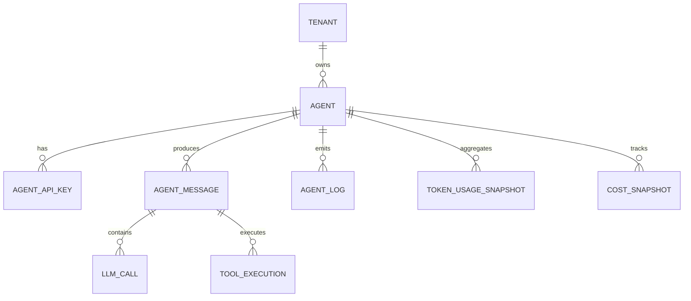

## Overview

Manifest uses **OpenTelemetry (OTLP)** as its native observability protocol. The system captures traces, metrics, and logs from AI agents via standard OTLP exporters, providing comprehensive visibility into LLM interactions.

## OpenTelemetry Architecture

### Plugin-Side Telemetry

The OpenClaw plugin (`packages/openclaw-plugin/src/telemetry.ts`) initializes OpenTelemetry SDKs:

```typescript
import { BasicTracerProvider, BatchSpanProcessor } from '@opentelemetry/sdk-trace-base';
import { MeterProvider, PeriodicExportingMetricReader } from '@opentelemetry/sdk-metrics';
import { OTLPTraceExporter } from '@opentelemetry/exporter-trace-otlp-http';
import { OTLPMetricExporter } from '@opentelemetry/exporter-metrics-otlp-http';

export function initTelemetry(
  config: ManifestConfig,
  logger: PluginLogger,
): { tracer: Tracer; meter: Meter } {
  const resource = new Resource({
    'service.name': 'openclaw-gateway',
    'service.version': process.env.PLUGIN_VERSION || '0.0.0',
    'manifest.plugin': 'true',
  });

  // Trace exporter
  const traceExporter = new OTLPTraceExporter({
    url: `${config.endpoint}/v1/traces`,
    headers: { Authorization: `Bearer ${config.apiKey}` },
  });

  tracerProvider = new BasicTracerProvider({
    resource,
    spanProcessors: [
      new BatchSpanProcessor(traceExporter, {
        scheduledDelayMillis: 5000,
        maxQueueSize: 2048,
        maxExportBatchSize: 512,
      }),
    ],
  });

  // Metrics exporter
  const metricExporter = new OTLPMetricExporter({
    url: `${config.endpoint}/v1/metrics`,
    headers: { Authorization: `Bearer ${config.apiKey}` },
  });

  meterProvider = new MeterProvider({
    resource,
    readers: [
      new PeriodicExportingMetricReader({
        exporter: metricExporter,
        exportIntervalMillis: 10000, // 10 seconds in dev/local mode
      }),
    ],
  });

  return { 
    tracer: trace.getTracer('manifest-plugin', process.env.PLUGIN_VERSION),
    meter: metrics.getMeter('manifest-plugin', process.env.PLUGIN_VERSION)
  };
}
```

### Batch Processing

Telemetry data is batched to reduce overhead:

- **Traces**: 5-second batch interval, up to 512 spans per batch
- **Metrics**: 10-second export interval (30 seconds in cloud mode)
- **Queue Size**: 2048 spans max before dropping

<Note>
  The gateway batches OTLP data internally. New messages may take 10-30 seconds to appear in the dashboard due to batching delays.
</Note>

## OTLP Ingestion Endpoints

### Endpoint Structure

```
POST /otlp/v1/traces
POST /otlp/v1/metrics
POST /otlp/v1/logs

Authorization: Bearer mnfst_...
Content-Type: application/json | application/x-protobuf
```

### Authentication

The `OtlpAuthGuard` validates agent API keys:

- **Key Format**: `mnfst_` prefix (40-character random string)
- **Storage**: Hashed with scrypt KDF in `agent_api_keys` table
- **Caching**: Valid keys cached in-memory for 5 minutes
- **Loopback Bypass**: In local mode, any non-`mnfst_*` token from `127.0.0.1` is accepted

```typescript
// Source: packages/backend/src/otlp/guards/otlp-auth.guard.ts
const isLoopback = LOOPBACK_IPS.has(clientIp);
const isDev = process.env.MANIFEST_MODE === 'local';

if (isDev && isLoopback && apiKey && !apiKey.startsWith('mnfst_')) {
  // Dev mode loopback bypass: trust local connections
  request.ingestionContext = { 
    userId: LOCAL_USER_ID, 
    tenantId: LOCAL_TENANT_ID, 
    agentId: LOCAL_AGENT_ID 
  };
  return true;
}
```

### Payload Formats

Manifest accepts both JSON and Protobuf encodings:

- **JSON**: `Content-Type: application/json` (standard OTLP JSON)
- **Protobuf**: `Content-Type: application/x-protobuf` (binary encoding)

The `OtlpDecoderService` handles format detection and parsing:

```typescript
// Source: packages/backend/src/otlp/services/otlp-decoder.service.ts
export class OtlpDecoderService {
  decodeTraces(
    contentType: string | undefined,
    body: unknown,
    rawBody?: Buffer,
  ): TracePayload {
    if (contentType?.includes('protobuf')) {
      return this.decodeTracesProtobuf(rawBody!);
    }
    return body as TracePayload; // JSON
  }
}
```

## Ingestion Pipeline

### Trace Processing

<Steps>
  <Step title="Authentication">
    `OtlpAuthGuard` validates Bearer token and attaches `ingestionContext` to request.
  </Step>
  <Step title="Decoding">
    `OtlpDecoderService` parses JSON or protobuf payload.
  </Step>
  <Step title="Span Extraction">
    Extract spans from `resourceSpans` array (OTLP data model).
  </Step>
  <Step title="Attribute Mapping">
    Map OpenTelemetry semantic conventions to Manifest entities:
    - `gen_ai.system` → provider
    - `gen_ai.request.model` → model
    - `gen_ai.usage.input_tokens` → prompt tokens
    - `gen_ai.usage.output_tokens` → completion tokens
  </Step>
  <Step title="Entity Creation">
    Create `AgentMessage` and `LlmCall` entities:
    ```typescript
    const message = this.messageRepo.create({
      agentId: ctx.agentId,
      spanId: span.spanId,
      traceId: span.traceId,
      timestamp: new Date(span.startTimeUnixNano / 1_000_000),
      provider: attributes['gen_ai.system'],
      model: attributes['gen_ai.request.model'],
      promptTokens: attributes['gen_ai.usage.input_tokens'] || 0,
      completionTokens: attributes['gen_ai.usage.output_tokens'] || 0,
      // ... other fields
    });
    ```
  </Step>
  <Step title="Cost Calculation">
    Lookup model pricing and compute costs:
    ```typescript
    const pricing = this.pricingCache.getByModel(model);
    if (pricing) {
      totalCost = 
        (promptTokens / 1_000_000) * pricing.inputCostPerMillion +
        (completionTokens / 1_000_000) * pricing.outputCostPerMillion;
    }
    ```
  </Step>
  <Step title="Batch Insert">
    Use TypeORM to insert entities in a transaction.
  </Step>
  <Step title="SSE Notification">
    Emit event to trigger real-time dashboard updates:
    ```typescript
    if (result.accepted > 0) {
      this.eventBus.emit(ctx.userId);
    }
    ```
  </Step>
</Steps>

### Metric Processing

Metrics are aggregated into snapshots:

- **Token Usage**: Hourly `TokenUsageSnapshot` records (model, provider, token counts)
- **Cost Snapshots**: Hourly `CostSnapshot` records (aggregated costs by model)

```typescript
// Source: packages/backend/src/otlp/services/metric-ingest.service.ts
for (const metric of metrics) {
  if (metric.name.startsWith('gen_ai.')) {
    const hour = truncateToHour(timestamp);
    await this.snapshotRepo.upsert({
      agentId: ctx.agentId,
      hour,
      model,
      provider,
      promptTokens: metric.value,
      // ... other fields
    }, ['agentId', 'hour', 'model']);
  }
}
```

### Log Processing

Logs are stored as `AgentLog` entities:

- **Severity Mapping**: OTLP severity levels → Manifest log levels
- **Body Extraction**: Parse log record body (string or structured)
- **Trace Correlation**: Link logs to traces via `trace_id` attribute

## Data Model

### Core Entities



### AgentMessage Entity

Primary entity for LLM interactions:

```typescript
@Entity('agent_messages')
export class AgentMessage {
  @PrimaryGeneratedColumn('uuid')
  id: string;

  @Column()
  agentId: string;

  @Column()
  spanId: string; // OTLP span ID

  @Column()
  traceId: string; // OTLP trace ID

  @Column({ type: 'timestamptz' })
  timestamp: Date;

  @Column({ nullable: true })
  provider: string | null;

  @Column({ nullable: true })
  model: string | null;

  @Column({ type: 'int', default: 0 })
  promptTokens: number;

  @Column({ type: 'int', default: 0 })
  completionTokens: number;

  @Column({ type: 'decimal', precision: 10, scale: 6, default: 0 })
  totalCost: number;

  @Column({ type: 'text', nullable: true })
  errorMessage: string | null;

  // Relationships
  @OneToMany(() => LlmCall, (call) => call.message)
  llmCalls: LlmCall[];

  @OneToMany(() => ToolExecution, (tool) => tool.message)
  toolExecutions: ToolExecution[];
}
```

### LlmCall Entity

Child span for individual LLM API calls:

```typescript
@Entity('llm_calls')
export class LlmCall {
  @PrimaryGeneratedColumn('uuid')
  id: string;

  @Column()
  messageId: string;

  @Column()
  spanId: string;

  @Column({ type: 'timestamptz' })
  startTime: Date;

  @Column({ type: 'int', nullable: true })
  durationMs: number | null;

  @Column({ nullable: true })
  provider: string | null;

  @Column({ nullable: true })
  model: string | null;

  @Column({ type: 'int', default: 0 })
  promptTokens: number;

  @Column({ type: 'int', default: 0 })
  completionTokens: number;

  @Column({ type: 'jsonb', nullable: true })
  request: Record<string, unknown> | null;

  @Column({ type: 'jsonb', nullable: true })
  response: Record<string, unknown> | null;

  @ManyToOne(() => AgentMessage, (msg) => msg.llmCalls)
  message: AgentMessage;
}
```

## Security Event Detection

Manifest scans message content for security issues:

### Detection Rules

| Event Type | Pattern | Severity |
|------------|---------|----------|
| **Prompt Injection** | SQL/code injection attempts | HIGH |
| **PII Leak** | SSN, credit card, email patterns | CRITICAL |
| **Excessive Tokens** | >100K tokens per request | MEDIUM |
| **High Error Rate** | >50% errors in last hour | HIGH |
| **Jailbreak Attempt** | Prompt manipulation patterns | HIGH |

```typescript
// Source: packages/backend/src/security/security.service.ts
const patterns = {
  promptInjection: /ignore previous instructions|disregard all/gi,
  ssnLeak: /\b\d{3}-\d{2}-\d{4}\b/g,
  creditCard: /\b\d{4}[\s-]?\d{4}[\s-]?\d{4}[\s-]?\d{4}\b/g,
};

for (const [type, pattern] of Object.entries(patterns)) {
  if (pattern.test(messageContent)) {
    await this.createSecurityEvent(agentId, type, ...);
  }
}
```

Events are stored in the `security_events` table and displayed in the Security dashboard.

## Real-time Updates (SSE)

The frontend receives live updates via Server-Sent Events:

### SSE Endpoint

```
GET /api/v1/events
Authorization: Cookie (session)
```

### Event Flow

<Steps>
  <Step title="Client Connection">
    Frontend opens EventSource connection to `/api/v1/events`.
  </Step>
  <Step title="Event Bus Registration">
    Backend adds connection to in-memory map keyed by `userId`.
  </Step>
  <Step title="Ingestion Trigger">
    When OTLP data is ingested, `IngestEventBusService.emit(userId)` is called.
  </Step>
  <Step title="SSE Broadcast">
    Server sends `data: refresh\n\n` to all connections for that user.
  </Step>
  <Step title="Dashboard Refresh">
    Frontend receives event and re-fetches dashboard data.
  </Step>
</Steps>

```typescript
// Source: packages/backend/src/sse/sse.controller.ts
@Get('events')
sseEvents(@Req() req: Request, @Res() res: Response): void {
  const userId = (req as any).user?.id;
  if (!userId) {
    res.status(401).end();
    return;
  }

  res.setHeader('Content-Type', 'text/event-stream');
  res.setHeader('Cache-Control', 'no-cache');
  res.setHeader('Connection', 'keep-alive');
  res.flushHeaders();

  this.eventBus.addConnection(userId, res);

  req.on('close', () => {
    this.eventBus.removeConnection(userId, res);
  });
}
```

## Query Performance

### Indexing Strategy

Key indexes for fast analytics queries:

```sql
CREATE INDEX idx_agent_messages_agent_timestamp 
  ON agent_messages(agent_id, timestamp DESC);

CREATE INDEX idx_agent_messages_trace_id 
  ON agent_messages(trace_id);

CREATE INDEX idx_token_usage_snapshot_hour 
  ON token_usage_snapshots(agent_id, hour DESC);

CREATE INDEX idx_llm_calls_message_id 
  ON llm_calls(message_id);
```

### Query Patterns

Manifest uses TypeORM QueryBuilder for all analytics:

```typescript
// Source: packages/backend/src/analytics/services/tokens.service.ts
const qb = this.messageRepo
  .createQueryBuilder('m')
  .select('DATE_TRUNC(\'hour\', m.timestamp)', 'hour')
  .addSelect('SUM(m.prompt_tokens + m.completion_tokens)', 'tokens')
  .where('m.agent_id IN (:...agentIds)', { agentIds })
  .andWhere('m.timestamp >= :start', { start })
  .andWhere('m.timestamp < :end', { end })
  .groupBy('hour')
  .orderBy('hour', 'ASC');

const result = await qb.getRawMany();
```

<Note>
  **Multi-tenant Isolation**: All queries use `addTenantFilter(qb, userId)` helper to ensure users only see their own data (source: `analytics/services/query-helpers.ts`).
</Note>

## Monitoring & Debugging

### Backend Logs

Manifest logs key ingestion events:

```
[OtlpController] [tenant-123/agent-abc] Traces: 15 spans
[OtlpController] [tenant-123/agent-abc] Metrics: 42 points
[TraceIngestService] Ingested 15 spans for agent agent-abc
```

### Plugin Debug Mode

Enable verbose logging in the plugin:

```typescript
logger.debug('[manifest] Trace exporter -> http://localhost:38238/otlp/v1/traces');
logger.debug('[manifest] Routing resolved: tier=standard model=gpt-4o-mini');
```

### Health Check

Verify backend status:

```bash
curl http://localhost:3001/api/v1/health
# Response: { "status": "ok", "timestamp": "2026-03-04T..." }
```

## Next Steps

<CardGroup cols={2}>
  <Card title="View Dashboard" icon="chart-pie" href="/features/dashboard">
    Monitor tokens, costs, and message volume
  </Card>
  <Card title="Configure Alerts" icon="bell" href="/features/alerts">
    Set up notification rules for usage thresholds
  </Card>
</CardGroup>