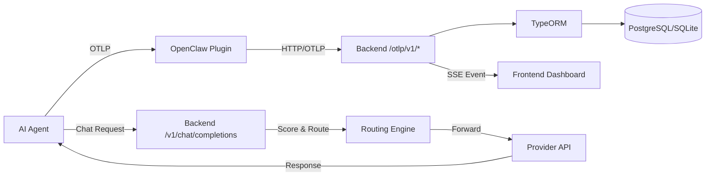

## What is Manifest?

Manifest is an intelligent LLM observability and routing platform that automatically routes your AI agent's requests to the optimal model based on task complexity. Instead of manually choosing models or defaulting to expensive options, Manifest analyzes each request in real-time and selects the most cost-effective model that can handle the task.

## How It Works

<Steps>
  <Step title="Connect Your Agent">
    Install the OpenClaw plugin or configure your agent to send OTLP telemetry to Manifest's backend.
  </Step>
  <Step title="Automatic Analysis">
    Manifest's 23-dimension scoring algorithm analyzes each request to determine task complexity.
  </Step>
  <Step title="Intelligent Routing">
    Based on the complexity score, Manifest routes the request to the appropriate tier (Simple, Standard, Complex, or Reasoning).
  </Step>
  <Step title="Real-time Observability">
    View tokens, costs, messages, and performance metrics in the dashboard.
  </Step>
</Steps>

## Core Components

### Plugin Layer
The OpenClaw plugin (`manifest` npm package) integrates with AI gateway platforms to capture telemetry and enable routing:
- **OTLP Export**: Captures traces, metrics, and logs using OpenTelemetry standards
- **Routing Integration**: Registers as an OpenAI-compatible provider with `model: "auto"`
- **Session Tracking**: Maintains conversation momentum for context-aware routing

### Backend Service
A NestJS-based API server that handles ingestion, routing, and analytics:
- **OTLP Ingestion**: Three dedicated endpoints (`/otlp/v1/traces`, `/metrics`, `/logs`)
- **Routing Engine**: Scores requests and resolves models via `/api/v1/routing/resolve`
- **LLM Proxy**: OpenAI-compatible endpoint at `/v1/chat/completions` for transparent routing
- **Analytics API**: Real-time dashboard data aggregation and timeseries queries

### Frontend Dashboard
A SolidJS-based web interface for monitoring and configuration:
- **Agent Overview**: Token usage, costs, message volume with sparkline charts
- **Message Log**: Paginated view of all agent interactions with filtering
- **Routing Config**: Tier assignments, provider connections, model selection
- **Real-time Updates**: Server-Sent Events (SSE) for live data streaming

### Database
PostgreSQL (cloud) or SQLite (local) for persistent storage:
- **Multi-tenant**: Data isolated by user via tenant entities
- **Entities**: 19 TypeORM entities covering agents, messages, API keys, pricing, security events
- **Migrations**: Automatic migration execution on startup (no schema sync)

## Deployment Modes

Manifest operates in two distinct modes:

<CardGroup cols={2}>
  <Card title="Local Mode" icon="laptop">
    Perfect for development and testing. Uses SQLite, no authentication, loopback-only access.
  </Card>
  <Card title="Cloud Mode" icon="cloud">
    Production-ready with PostgreSQL, Better Auth (email/OAuth), and multi-tenant isolation.
  </Card>
</CardGroup>

See [Cloud vs Local](/concepts/cloud-vs-local) for detailed comparison.

## Key Features

### Intelligent Cost Optimization
Manifest's routing algorithm considers 23 dimensions to match requests with the right model:
- **Simple tasks** (greetings, basic questions) → Lightweight models
- **Standard tasks** (code generation, tool use) → Mid-tier models  
- **Complex tasks** (large context, nested logic) → Advanced models
- **Reasoning tasks** (formal proofs, deep analysis) → Frontier models

### OpenTelemetry Native
Full OTLP support means:
- Standard protocol for traces, metrics, logs
- Compatible with existing observability tooling
- Vendor-neutral telemetry collection
- Batch processing for efficiency (5-30 second intervals)

### Provider Agnostic
Connect any LLM provider:
- OpenAI, Anthropic, Google, DeepSeek, xAI (Grok)
- API keys encrypted with AES-256-GCM
- Provider-specific adapters for protocol differences
- Automatic model pricing sync

### Real-time Monitoring
- Token usage trends with hourly granularity
- Cost breakdowns by model and provider
- Security event tracking (prompt injection, PII leaks)
- Alert rules with email notifications (Mailgun, Resend, SMTP)

## Data Flow

## Security & Privacy

- **API Key Hashing**: Agent OTLP keys (`mnfst_*`) hashed with scrypt KDF
- **Provider Key Encryption**: LLM API keys encrypted at rest with AES-256-GCM
- **Content Security Policy**: Strict CSP with no external CDNs (self-hosted assets only)
- **Rate Limiting**: Global throttle guard (100 req/min default)
- **Multi-tenant Isolation**: All queries filtered by `userId` via helper functions

## Next Steps

<CardGroup cols={2}>
  <Card title="Routing Algorithm" icon="shuffle" href="/concepts/routing">
    Deep dive into the 23-dimension scoring system
  </Card>
  <Card title="Observability" icon="chart-line" href="/concepts/observability">
    Learn about OTLP integration and telemetry
  </Card>
  <Card title="Architecture" icon="sitemap" href="/concepts/architecture">
    Explore system components and data flow
  </Card>
  <Card title="Deployment Modes" icon="server" href="/concepts/cloud-vs-local">
    Choose between local and cloud modes
  </Card>
</CardGroup>